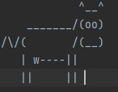
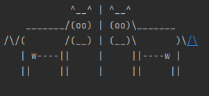

# ASCII Mirror

___

A Jetbrains Academy project. Written using Java.

The application reads a text file with an ASCII image and then outputs the ASCII image
with a mirror image next to it.

___

## Learning Ouctomes

* Java basics
* input, output, strings, files, lists
___

## Instructions

1. Upon running app. The user will be prompted to enter a file path in the console.

        example input: ASCII_Animals/HumphFolder/Cow.txt

    Camel.txt contents:
       

2. The app will output the ASCII text image and a mirror ASCII text image to the right.

    

        Output example:

